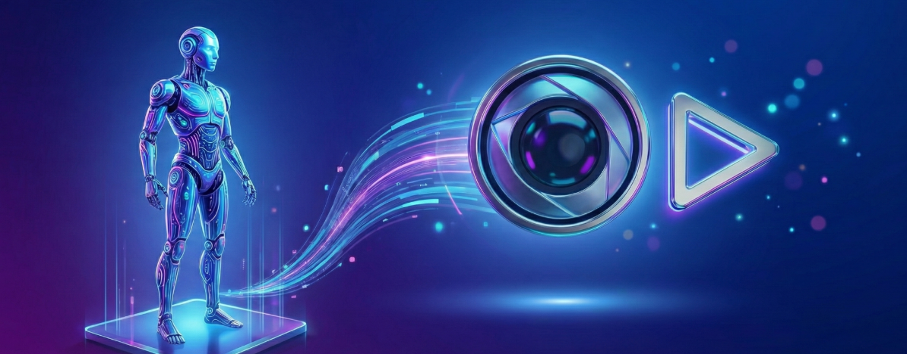

# Awesome Video Generation for Robotics

[🎥 Follow X for updates 🎥](https://x.com/VideoGenPapers) 

  

A curated list of research papers, projects, and resources leveraging **Video Generation models for Robotics**.  
This includes Physics-aware Video Synthesis, World Models, and Generative Simulation.

## 📖 Table of Contents

- [Video Generation for Imitation Learning](#video-generation-for-imitation-learning)
- [Video Generation for Human Tranfer](#video-generation-for-human-transfer)
- [Video for Reinforcement Learning](#generative-simulation--sim-to-real)
- [World Models for Robotics](#world-models-for-robotics)
- [Datasets](#datasets)

---

## Video Generation for Imitation Learning
*Video generation with physical realism for effective policy learning.*

### 2025
- **[Paper Title Here](PDF_LINK)** (CVPR)  
  *Author Name, et al.* [[Project Page](LINK)] [[Code](LINK)]  
  > 📝 **TL;DR:** Hoge

---

## Video Generation for Human Transfer

---

## Datasets

| Dataset | Description | Modality | Size | Year |
| :--- | :--- | :--- | :--- | :--- |
| **[OpenEgo](https://github.com/physicalinc/openego?tab=readme-ov-file)** | Egocentric multimodal manipulation dataset | Video, 3D Hand Poses, Language Primitives | **1107 hours** of video (119.6M frames) and 344.5k recordings. **290 manipulation tasks** across 600+ environments| 2025 |
| **[EgoEdit](https://snap-research.github.io/EgoEdit/)** | Egocentric video dataset | Video | **99.7k editing pairs** (49.7k unique videos) | 2025 |

---

## Contributing

Contributions are welcome! Please format your pull request as follows:
`- **[Title](Link)** (Venue) [[Code](Link)] - Summary`

## License
 

This repository is licensed under the Apache License 2.0.  
See the [LICENSE](./LICENSE) file for details. 